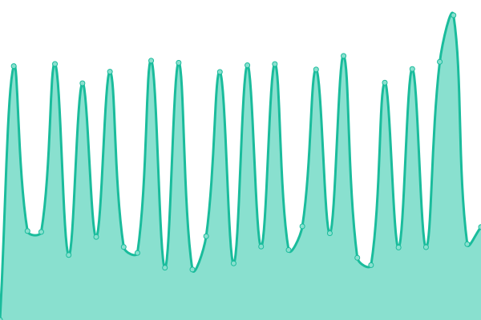
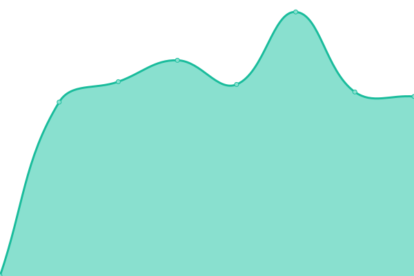

# [📈 Live Status](https://ihs.status.migraine.kr): <!--live status--> **🟧 Partial outage**

This repository contains the open-source uptime monitor and status page for [편두통케어](https://migraine.kr/), powered by [Upptime](https://github.com/upptime/upptime).

With [Upptime](https://upptime.js.org), you can get your own unlimited and free uptime monitor and status page, powered entirely by a GitHub repository. We use [Issues](https://github.com/MigraineKR/ihs.status/issues) as incident reports, [Actions](https://github.com/MigraineKR/ihs.status/actions) as uptime monitors, and [Pages](https://ihs.status.migraine.kr) for the status page.

<!--start: status pages-->
<!-- This summary is generated by Upptime (https://github.com/upptime/upptime) -->
<!-- Do not edit this manually, your changes will be overwritten -->
<!-- prettier-ignore -->
| URL | Status | History | Response Time | Uptime |
| --- | ------ | ------- | ------------- | ------ |
|  [ihs-headache.org](https://ihs-headache.org/) | 🟩 Up | [ihs-headache-org.yml](https://github.com/MigraineKR/ihs.status/commits/HEAD/history/ihs-headache-org.yml) | 

 3149ms
     
 | 

<a href="https://ihs.status.migraine.kr/history/ihs-headache-org">96.59%</a>
    

|  [ihc2022.org](https://ihc2022.org/) | 🟥 Down | [ihc2022-org.yml](https://github.com/MigraineKR/ihs.status/commits/HEAD/history/ihc2022-org.yml) | 

 0ms
     
 | 

<a href="https://ihs.status.migraine.kr/history/ihc2022-org">0.00%</a>
    

|  [ihc2023.org](https://ihc2023.org/) | 🟩 Up | [ihc2023-org.yml](https://github.com/MigraineKR/ihs.status/commits/HEAD/history/ihc2023-org.yml) | 

 1136ms
     
 | 

<a href="https://ihs.status.migraine.kr/history/ihc2023-org">100.00%</a>
    

<!--end: status pages-->

[**Visit our status website →**](https://ihs.status.migraine.kr)

## 📄 License

- Powered by: [Upptime](https://github.com/upptime/upptime)
- Code: [MIT](./LICENSE) © [편두통케어](https://migraine.kr/)
- Data in the `./history` directory: [Open Database License](https://opendatacommons.org/licenses/odbl/1-0/)
